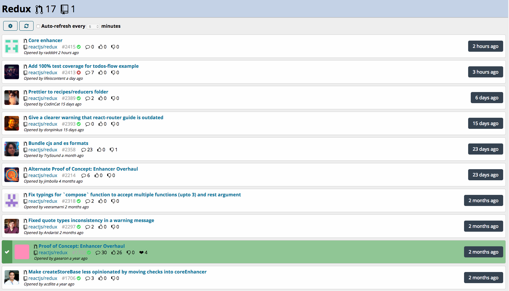

# github-pr-dashboard

See pull requests at a glance, across multiple repos

# Setup
After cloning the repository, run `npm install` to install dependencies.
To build the client-side code, run either `npm run dev-build` (if you're developing)
or `npm run build`.

# Configuration

Copy the file `config/config.json.sample` to `config/config.json`. If you are accessing public GitHub, you don't need to change the `apiBaseUrl` option. If you are accessing a GitHub Enterprise instance, you will need to set `apiBaseUrl` to the base URL of your GitHub Enterprise installation, e.g. `https://github.mycompany.com/api/v3`.  To use the GitHub Personal Access Token for accessing private repositories, `username` and `password` lines in `config/config.json` can be replaced with a single `"token": "MY_PERSONAL_TOKEN"` line. 

GitHub places a very strict rate limit on unauthenticated requests. If you run into this problem, you will need to add your GitHub username and password in `config.json`.

# Running the server
To run the PR dashbaord server, run `npm start`. This will start the server, listening on port 8080. You can change the port number by setting a `PORT` environment variable, e.g. `export PORT=80`.

## Running with Docker

You can build and run a Dockerized version of the app within a container without installing any dependencides locally.
Make sure you have already created a `config.json` as described above.

To build a new application image, in the project directory run:

`docker build -t joeattardi/github-pr-dashboard .`

To run the application:

`docker run -p 8080:8080 -d joeattardi/github-pr-dashboard`

or if you specified a custom `PORT` to run the app on:

`docker run -p $PORT:8080 -d joeattardi/github-pr-dashboard`

# Adding repositories
Once the server is running, visit it in your web browser and click the gear icon.
